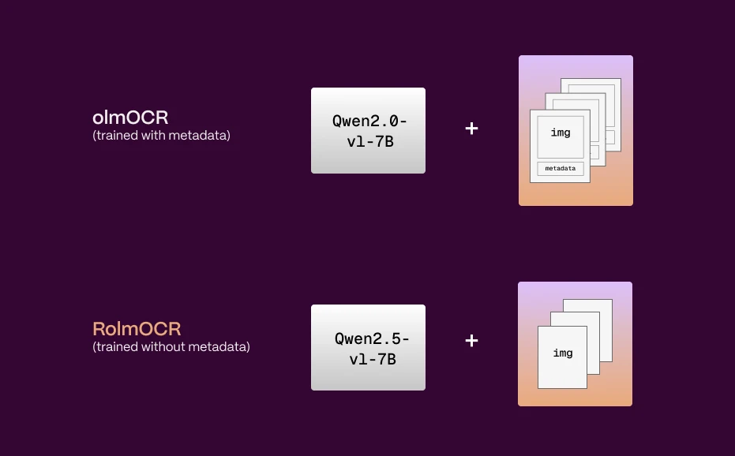
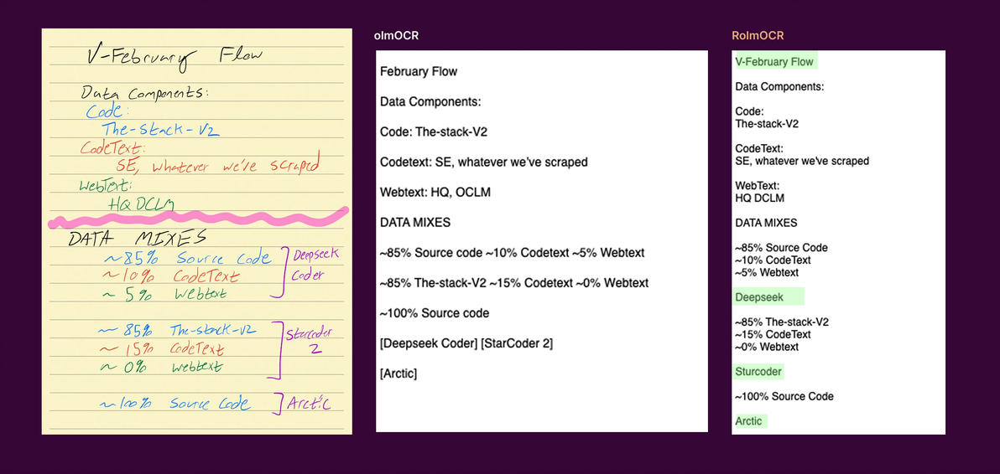
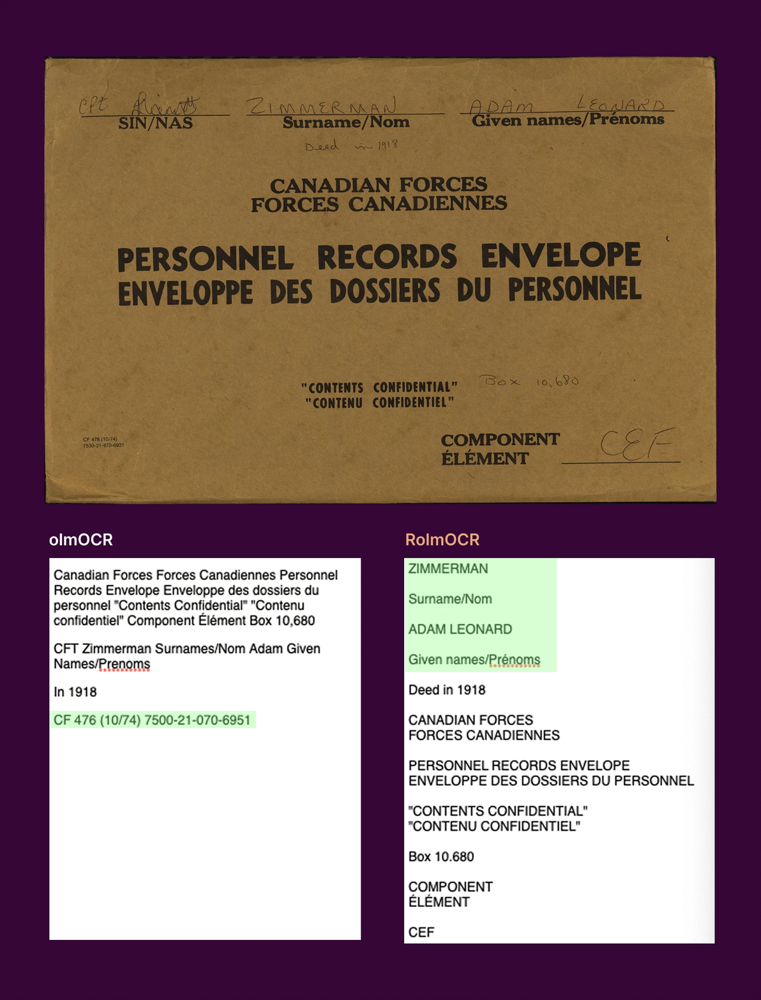

# RolmOCR：基于olmOCR开源的OCR 模型！更快、更轻量，开箱即用！ - 哔哩哔哩

原文链接: https://www.bilibili.com/opus/1053337104439836693

   AI-GitHub 关注  RolmOCR：基于olmOCR开源的OCR 模型！更快、更轻量，开箱即用！ AI-GitHub 编辑于 2025年04月08日 12:45    收录于文集  AI开源项目汇总 · 225篇 

Reducto 团队基于 Allen Institute for AI 发布的 **olmOCR** 模型，构建了一个性能更优、资源占用更低的替代模型：**RolmOCR**。

它比之前的模型：

* **更快**
* **占用更少****内存**
* **识别效果更好**

该模型不依赖复杂的文档结构信息，能更灵活处理扫描文档和非标准格式的内容。它适用于 OCR（文字识别）、文档处理、信息抽取等场景。

你可以把它当成一个 **开箱即用的** **AI****OCR** **工具**，还可以修改代码做你自己的定制版本！

RolmOCR 做了三大技术优化：

1. **更新了基础****大模型****：**基于更先进的视觉语言模型 **Qwen2.5-VL-7B**。识别图像+文字的能力更强，尤其是对不规则文本、图像中嵌套文字等。

2. **不使用 PDF 元数据：**Prompt 更短，模型处理更快，显存（VRAM）占用更少。

3. **训练数据****中加入“旋转图像”：**他们把 **15% 的训练图像旋转**了角度，比如歪着的扫描件、拍歪的文档。这样能让模型更好应对“角度奇怪”的真实文件，提高鲁棒性。

他们用了两个案例，测试 RolmOCR 和原版 olmOCR 的差别：

**案例 1：手写笔记 + 注释**

RolmOCR 识别更准确，把“错读”的内容修正了，比如把 “OCLM” 正确识别为 “DCLM”。

**案例 2：中英文混排的信封照片（低对比度）**

RolmOCR 读取得更完整，尽管有小字体漏掉。

GitHub：https://huggingface.co/reducto/RolmOCR

 [GitHub](//search.bilibili.com/all?keyword=GitHub) [AI技术](//search.bilibili.com/all?keyword=AI%E6%8A%80%E6%9C%AF) [AI开源项目推荐](//search.bilibili.com/all?keyword=AI%E5%BC%80%E6%BA%90%E9%A1%B9%E7%9B%AE%E6%8E%A8%E8%8D%90) [开源OCR](//search.bilibili.com/all?keyword=%E5%BC%80%E6%BA%90OCR) [AI文档解析](//search.bilibili.com/all?keyword=AI%E6%96%87%E6%A1%A3%E8%A7%A3%E6%9E%90) [RolmOCR](//search.bilibili.com/all?keyword=RolmOCR)
分享至

 微信扫一扫分享  

 投诉或建议        目录 (0)    正序     8    0    8   0  1 回到旧版 
顶部
   
给UP主投上1枚硬币
   1硬币 确定

经验值+10（今日0/50）

 