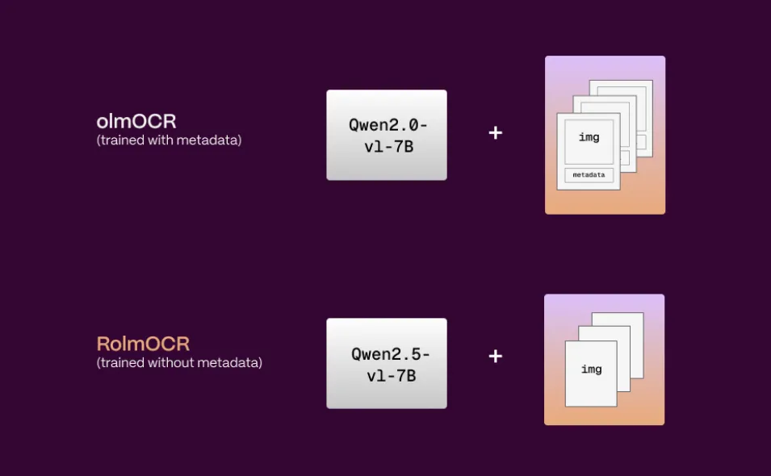

# RolmOCR：识别手写和倾斜字符的文档OCR模型-首席AI分享圈

原文链接: https://www.aisharenet.com/rolmocr/


[🚀邀请体验：中国首家 AI IDE 智能编程软件 Trae 中文版下载，不限量使用 DeepSeek-R1 和 Doubao-pro!](https://www.aisharenet.com/feed/tree)
## 综合介绍

RolmOCR 是由 Reducto AI 团队开发的一款开源光学字符识别（OCR）工具，基于 Qwen2.5-VL-7B 视觉语言模型。它能从图片和 PDF 文件中提取文字，速度比同类工具 [olmOCR](https://www.aisharenet.com/olmocr/) 更快，内存占用更低。RolmOCR 不依赖 PDF 元数据，简化了处理流程，同时支持多种文档类型，包括手写笔记和学术论文。它在 Apache 2.0 许可下发布，免费供个人和开发者使用、修改或集成。Reducto 团队通过更新模型、优化训练数据打造了这款工具，目标是让文档数字化更高效。



  


## 功能列表

* 快速文字提取：从图片和 PDF 中提取文字，处理速度快，适合大量文档。
* 支持多种文档：能识别手写笔记、打印文件和复杂表格。
* 开源免费：在 Apache 2.0 许可下开放，代码可自由下载和调整。
* 低内存占用：相比 [olmOCR](https://www.aisharenet.com/olmocr/) 更省资源，运行时对电脑要求低。
* 无需元数据：直接处理原始文档，不用依赖 PDF 的额外信息。
* 增强倾斜文档识别：训练数据中 15% 被旋转，提升对非正角度文档的适应性。
* 基于最新模型：采用 Qwen2.5-VL-7B，提升识别准确度和效率。

## 使用帮助

RolmOCR 是一个开源工具，主要通过代码运行，适合有编程基础的用户。以下是详细的安装和使用指南。

### 安装流程

1. **检查 Python 环境**  
   
   RolmOCR 需要 Python 3.8 或更高版本。打开命令行，输入 `python --version` 查看版本。如果没有安装，去 Python 官网 下载并安装。
2. **安装 vLLM 框架**  
   
   RolmOCR 使用 [vLLM](https://www.aisharenet.com/vllm/) 运行模型。在命令行输入：

```
pip install vllm

```

安装完成后，设置环境变量：

```
export VLLM_USE_V1=1

```

这能确保 vLLM 正常工作。

3. **下载 RolmOCR 模型**  
   
   模型文件在 Hugging Face 上托管。访问 https://huggingface.co/reducto/RolmOCR，点击“Files and versions”下载。或者用命令行拉取：

```
git clone https://huggingface.co/reducto/RolmOCR

```

4. **启动本地服务**  
   
   进入下载的模型文件夹，运行：

```
vllm serve reducto/RolmOCR

```

服务启动后，默认地址是 `http://localhost:8000/v1`。保持命令行窗口打开。

### 使用方法

RolmOCR 通过 API 调用来提取文字。以下是具体步骤。

#### 准备文件

准备需要识别的文件，比如图片（PNG/JPG）或 PDF。假设文件路径是 `test_doc.png`。

#### 调用 API 提取文字

用 Python 编写脚本，把文件转为 base64 编码后发送给 RolmOCR。示例代码如下：

```
from openai import OpenAI
import base64
# 连接本地服务
client = OpenAI(api_key="123", base_url="http://localhost:8000/v1")
model = "reducto/RolmOCR-7b"
# 图片转 base64
def encode_image(image_path):
with open(image_path, "rb") as image_file:
return base64.b64encode(image_file.read()).decode("utf-8")
# 调用 RolmOCR 提取文字
def ocr_page_with_rolm(img_base64):
response = client.chat.completions.create(
model=model,
messages=[
{
"role": "user",
"content": [
{"type": "image_url", "image_url": {"url": f"data:image/png;base64,{img_base64}"}},
{"type": "text", "text": "把这张图片里的文字提取出来，像人读的那样自然返回。"}
]
}
],
temperature=0.2,
max_tokens=4096
)
return response.choices[0].message.content
# 运行示例
test_img_path = "test_doc.png"
img_base64 = encode_image(test_img_path)
result = ocr_page_with_rolm(img_base64)
print(result)

```

保存为 `ocr_test.py`，然后运行：

```
python ocr_test.py

```

程序会返回提取的文字，比如：

```
会议记录
2025年4月7日
- 项目计划讨论
- 准备相关资料

```
#### 批量处理

要处理多份文件，可以改写代码。把文件路径放进列表，循环调用：

```
file_paths = ["doc1.png", "doc2.png", "doc3.png"]
for path in file_paths:
img_base64 = encode_image(path)
result = ocr_page_with_rolm(img_base64)
print(f"{path} 的结果：\n{result}\n")

```
### 特色功能操作

1. **手写文字识别**  
   
   RolmOCR 能识别手写内容。比如一张写着“Deepseek Coder”的笔记，它能准确输出，不会误认成“OCLM”。上传图片后，结果会按自然顺序排列。
2. **倾斜文档处理**  
   
   训练数据中 15% 被旋转，所以它对倾斜的文档更适应。比如一张歪斜的扫描件，文字依然能正确提取。
3. **低内存运行**  
   
   不依赖元数据，提示长度变短，处理时占用的显存（VRAM）更少。适合配置较低的电脑。

### 注意事项

* **服务中断**：启动服务后，不要关闭命令行窗口，否则 API 会停止。
* **内存不足**：如果电脑内存不够，可以调整 vLLM 参数，比如 `per_device_train_batch_size`，降低资源需求。
* **局限性**：RolmOCR 可能漏掉低对比度的小文字，或对无元数据的复杂表格识别不全。建议优化图片质量后再试。
* **不支持布局框**：不像 Reducto 的商业 API，RolmOCR 无法输出文字的bounding box（位置框）。

通过这些步骤，用户可以轻松安装和使用 RolmOCR，把文档中的文字快速提取出来。

## 应用场景

1. **学术研究**  
   
   学生和研究者可以用 RolmOCR 扫描手写笔记或老旧文献，转成电子文本，方便整理和搜索。
2. **企业文档处理**  
   
   公司能用它提取合同、信封上的文字，录入系统，减少手动工作。
3. **多语言支持**  
   
   处理中英文混合文档或法语手写信件，快速提取信息，适合跨国交流。

## QA

1. **RolmOCR 和 olmOCR 有什么区别？**  
   
   RolmOCR 基于更新的 Qwen2.5-VL-7B 模型，速度更快，内存占用低，不用元数据，且对倾斜文档更robust。
2. **可以离线使用吗？**  
   
   可以。只要下载模型并启动本地服务，无需联网。
3. **支持表格识别吗？**  
   
   支持，但对无元数据的复杂表格可能漏掉部分内容，比如学术论文中的副标题。

### 相关文章

* [自动解析PDF内容并提取文字与表格的开源服务](https://www.aisharenet.com/pdf-document-layout-analysis/ "自动解析PDF内容并提取文字与表格的开源服务")
* [uniOCR：跨平台开源的文字识别工具](https://www.aisharenet.com/uniocr/ "uniOCR：跨平台开源的文字识别工具")
* [PDF Craft：PDF扫描文件转Markdown的开源工具](https://www.aisharenet.com/pdf-craft/ "PDF Craft：PDF扫描文件转Markdown的开源工具")
* [SmolDocling：小体积高效处理文档的视觉语言模型](https://www.aisharenet.com/smoldocling/ "SmolDocling：小体积高效处理文档的视觉语言模型")
* [Ollama OCR：使用Ollama中视觉模型提取图像中的文本](https://www.aisharenet.com/ollama-ocr/ "Ollama OCR：使用Ollama中视觉模型提取图像中的文本")
* [Chunkr：使用视觉模型进行文档摄取以及根据文本段落层级智能分块的一体化服务](https://www.aisharenet.com/chunkr/ "Chunkr：使用视觉模型进行文档摄取以及根据文本段落层级智能分块的一体化服务")
 
[](images/1ee6aafcf9df3d2fc4f55b58651341f9.jpg)
 