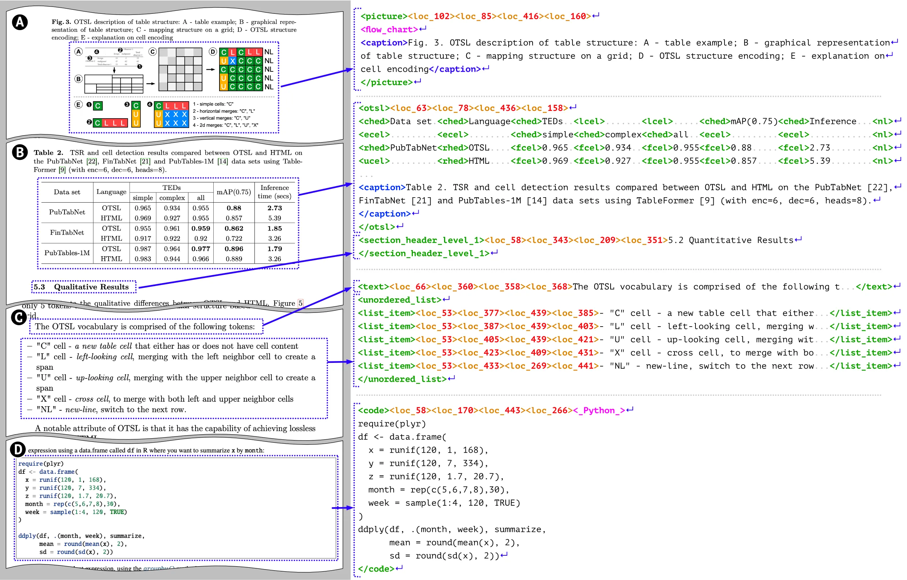
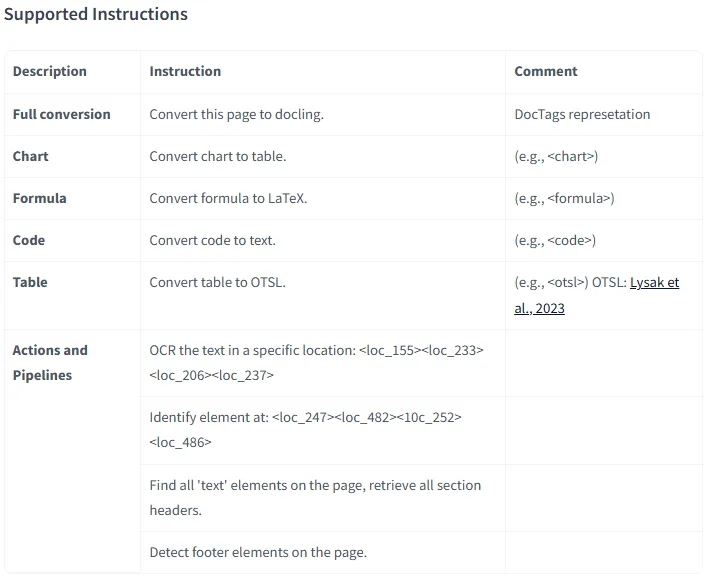

# SmolDocling：小体积高效处理文档的视觉语言模型-首席AI分享圈

原文链接: https://www.aisharenet.com/smoldocling/


[🚀邀请体验：中国首家 AI IDE 智能编程软件 Trae 中文版下载，不限量使用 DeepSeek-R1 和 Doubao-pro!](https://www.aisharenet.com/feed/tree)
## 综合介绍

SmolDocling 是由 ds4sd 团队与 IBM 合作开发的一个视觉语言模型（VLM），基于 SmolVLM-256M 打造，托管在 Hugging Face 平台。它体积小，只有 256M 参数，却是全球最小的 VLM。它的核心功能是从图片中提取文字、识别布局、代码、公式和图表，并生成结构化的 DocTags 格式文档。SmolDocling 在普通设备上就能运行，效率高，资源占用少。开发团队通过开源方式分享这个模型，希望帮助更多人处理文档任务。它是 SmolVLM 家族的一部分，专注于文档转换，适合需要快速处理复杂文档的用户。




  



## 功能列表

* **文字提取（OCR）**：从图片中识别并提取文字，支持多语言。
* **布局识别**：分析图片中文档的结构，如标题、段落、表格的位置。
* **代码识别**：提取代码块并保留缩进和格式。
* **公式识别**：检测数学公式并转为可编辑文本。
* **图表识别**：解析图片中的图表内容并提取数据。
* **表格处理**：识别表格结构，保留行列信息。
* **DocTags 输出**：将处理结果转为统一的标记格式，方便后续使用。
* **高分辨率图像处理**：支持更大分辨率的图片输入，提升识别精度。

## 使用帮助

SmolDocling 的使用分为安装和操作两部分。以下是详细步骤，帮助用户快速上手。

### 安装流程

1. **准备环境**
   * 确保电脑已安装 Python 3.8 或更高版本。
   * 在终端输入以下命令安装依赖库：
     ```
     pip install torch transformers docling_core
     
     ```
   * 如果有 GPU，推荐安装支持 CUDA 的 PyTorch，运行更快。检查方法：
     ```
     import torch
     print("GPU可用：" if torch.cuda.is_available() else "使用CPU")
     
     ```
2. **加载模型**
   * SmolDocling 不需要手动下载，直接通过代码从 Hugging Face 获取。
   * 确保网络畅通，首次运行会自动下载模型文件。

### 使用步骤

1. **准备图片**
   * 找一张包含文字的图片，比如扫描文档或截图。
   * 用代码加载图片：
     ```
     from transformers.image_utils import load_image
     image = load_image("你的图片路径.jpg")
     
     ```
2. **初始化模型和处理器**
   * 加载 SmolDocling 的处理器和模型：
     ```
     from transformers import AutoProcessor, AutoModelForVision2Seq
     DEVICE = "cuda" if torch.cuda.is_available() else "cpu"
     processor = AutoProcessor.from_pretrained("ds4sd/SmolDocling-256M-preview")
     model = AutoModelForVision2Seq.from_pretrained(
     "ds4sd/SmolDocling-256M-preview",
     torch_dtype=torch.bfloat16
     ).to(DEVICE)
     
     ```
3. **生成 DocTags**
   * 设置输入并运行模型：
     ```
     messages = [{"role": "user", "content": [{"type": "image"}, {"type": "text", "text": "Convert this page to docling."}]}]
     prompt = processor.apply_chat_template(messages, add_generation_prompt=True)
     inputs = processor(text=prompt, images=[image], return_tensors="pt").to(DEVICE)
     generated_ids = model.generate(**inputs, max_new_tokens=8192)
     doctags = processor.batch_decode(generated_ids[:, inputs.input_ids.shape[1]:], skip_special_tokens=False)[0].lstrip()
     print(doctags)
     
     ```
4. **转为常用格式**
   * 将 DocTags 转为 Markdown 或其他格式：
     ```
     from docling_core.types.doc import DoclingDocument
     doc = DoclingDocument(name="我的文档")
     doc.load_from_doctags(doctags)
     print(doc.export_to_markdown())
     
     ```
5. **高级用法（可选）**
   * **处理多页文档**：用循环处理多张图片，然后合并 DocTags。
   * **优化性能**：设置 `torch_dtype=torch.bfloat16` 节省内存，GPU 用户可启用 `flash_attention_2` 加速：
     ```
     model = AutoModelForVision2Seq.from_pretrained(
     "ds4sd/SmolDocling-256M-preview",
     torch_dtype=torch.bfloat16,
     _attn_implementation="flash_attention_2" if DEVICE == "cuda" else "eager"
     ).to(DEVICE)
     
     ```

### 操作技巧

* **图片要求**：图片需清晰，文字可辨识，分辨率越高效果越好。
* **调整参数**：如果结果不完整，增加 `max_new_tokens`（默认 8192）。
* **批量处理**：多张图片可以用列表传入 `images=[image1, image2]`。
* **调试方法**：输出中间结果检查，比如打印 `inputs` 查看输入是否正确。

### 注意事项

* 首次运行需联网，之后可离线使用。
* 图片过大可能导致内存不足，建议裁剪后处理。
* 如果遇到错误，检查 Python 版本和依赖库是否正确安装。

通过以上步骤，用户可以用 SmolDocling 把图片转为结构化文档。整个过程简单，适合初学者和专业用户。

## 应用场景

1. **学术研究**  
   
   将扫描的论文转为文本，提取公式和表格，方便编辑和引用。
2. **编程文档整理**  
   
   把包含代码的手册图片转为 Markdown，保留代码格式，适合开发者使用。
3. **办公自动化**  
   
   处理合同、报告等扫描件，识别布局和内容，提高工作效率。
4. **教育支持**  
   
   将教材图片转为可编辑文档，帮助教师和学生整理笔记。

## QA

1. **SmolDocling 和 SmolVLM 有什么区别？**  
   
   SmolDocling 是基于 SmolVLM-256M 优化的版本，专注于文档处理，输出 DocTags 格式，而 SmolVLM 更通用，支持图像描述等任务。
2. **支持哪些操作系统？**  
   
   支持 Windows、Mac 和 Linux，只要安装 Python 和依赖库即可运行。
3. **处理速度快吗？**  
   
   在普通电脑上处理一张图片只需几秒，GPU 用户更快，通常不到 1 秒。
4. **可以处理手写文字吗？**  
   
   可以，但效果取决于字迹清晰度，建议使用印刷文字图片以获得最佳结果。

### 相关文章

* [自动解析PDF内容并提取文字与表格的开源服务](https://www.aisharenet.com/pdf-document-layout-analysis/ "自动解析PDF内容并提取文字与表格的开源服务")
* [PDF Craft：PDF扫描文件转Markdown的开源工具](https://www.aisharenet.com/pdf-craft/ "PDF Craft：PDF扫描文件转Markdown的开源工具")
* [Ollama OCR：使用Ollama中视觉模型提取图像中的文本](https://www.aisharenet.com/ollama-ocr/ "Ollama OCR：使用Ollama中视觉模型提取图像中的文本")
* [Chunkr：使用视觉模型进行文档摄取以及根据文本段落层级智能分块的一体化服务](https://www.aisharenet.com/chunkr/ "Chunkr：使用视觉模型进行文档摄取以及根据文本段落层级智能分块的一体化服务")
* [Docling：支持多种格式文档解析并导出为Markdown和JSON，PDF支持OCR](https://www.aisharenet.com/docling/ "Docling：支持多种格式文档解析并导出为Markdown和JSON，PDF支持OCR")
* [文本提取API（text-extract-api）：视觉提取文本信息，匿名化的PDF提取工具](https://www.aisharenet.com/pdf-extract-api/ "文本提取API（text-extract-api）：视觉提取文本信息，匿名化的PDF提取工具")
 
[](https://www.aisharenet.com/feed/ylcdn)
 